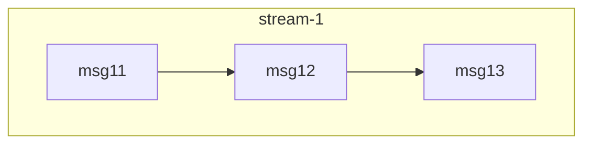
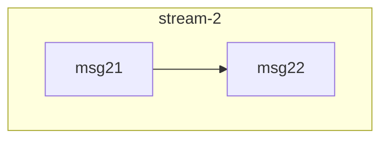
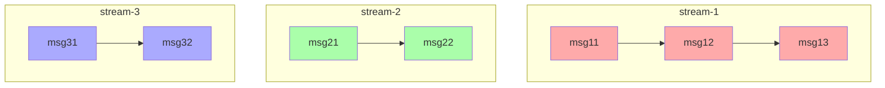
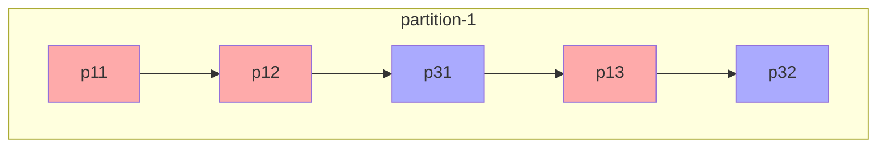
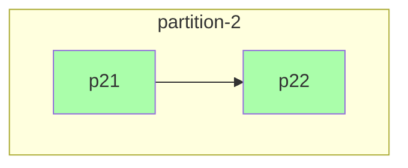

# Data model

## Messages

The smallest unit of storage is a message. The content of messages is transparent
to Depeche DB. Every message needs two basic properties so that it can be stored
and processed: An `ID` of type UUID and a timestamp.

## Streams

A stream has a name and contains messages. The message store can contain as many
streams as you need.

Messages in a stream are ordered. Their position within the stream is called
`version`. The `version`s in a stream do not have gaps and are unique.

Usually, a stream will be relatively small because it only contains messages
concerning a single domain object.

## Message store

The message store contains multiple streams. Messages are assigned a global
position when they are added to a stream. This global position is unique but
there can be gaps (when transactions are rolled back). For messages `a` and `b`
within the same stream, it is guaranteed that if `a.version < b.version` then
`a.global_position < b.global_position` and vice versa.

## Aggregated streams

Because of the high granularity of the streams, it is not pratical to subscribe
to them directly. That is why there is the notion of an aggregated stream which
aggregates the messages from several streams. The selection of the origin streams
is done by match expressions, e.g. the expression `foo-%` will match streams
like `foo-1`, `foo-123` etc. An origin stream can be part of multiple
aggregated streams.

Aggregated streams consist of partitions. Messages from the origin streams
can be assigned to partitions by a user defined function. When a message is
added to a partition within an aggregated stream, it is **not** copied but linked
to. Thus, aggregated streams are rather light-weight on the storage size.

The partitions is what gives us the possibility of concurrency while processing
messages. You have to be careful when selecting a partition key or function.
Messages which must be processed in the order in which they occurred in need to
end up in the same partition.

Given these streams:

The partitions of an example aggregated stream could look like this:

Messages are assigned a unique & gapless `position` within their partition. The
order of messages within a partition is based on their global position in the
message store. This cannot be guaranteed though, because transactions writing
to the messages store might be committed "out of order". The messages will be
out of order concerning their global position, if the aggregated stream is
updated between those commits.

Please note that this example partitioning (which used the stream name as the
partition key) is only one possibility. Users can define how messages are
partitioned. Furthermore, you can create multiple aggregated streams which
contain the same or overlapping sets of messages with different partitioning
strategies. This allows you to tailor the aggregated streams - more
specifically their ordering and possible parallelism - to the needs of
different consumers.
