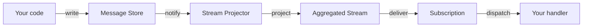
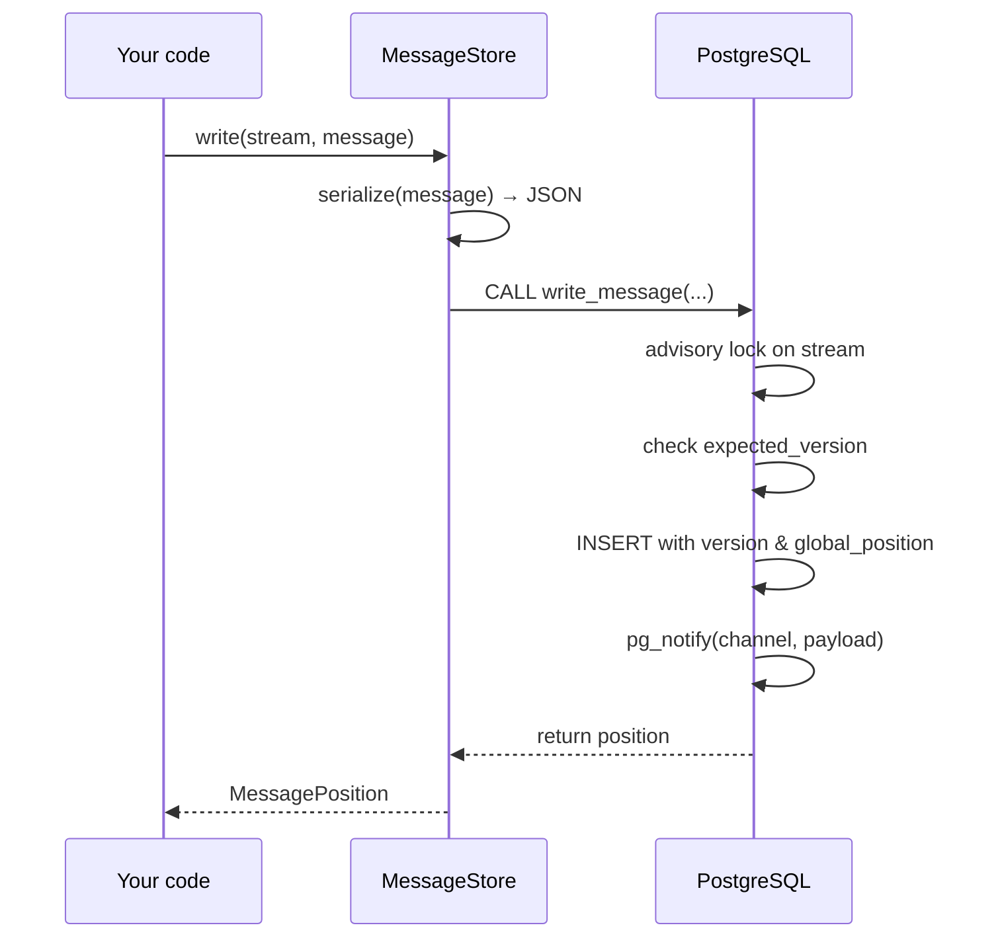
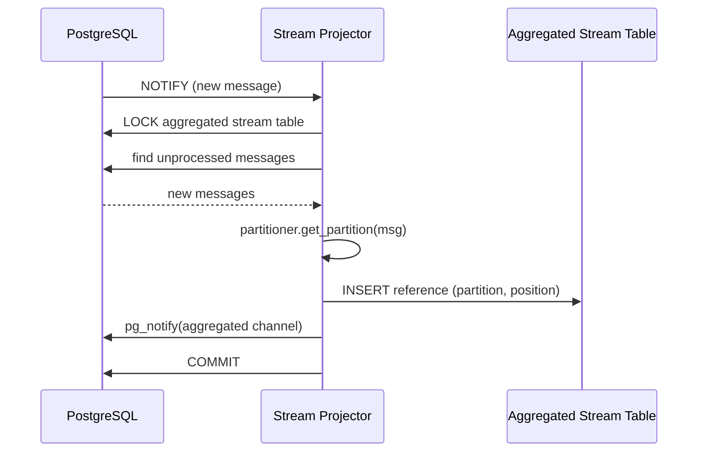
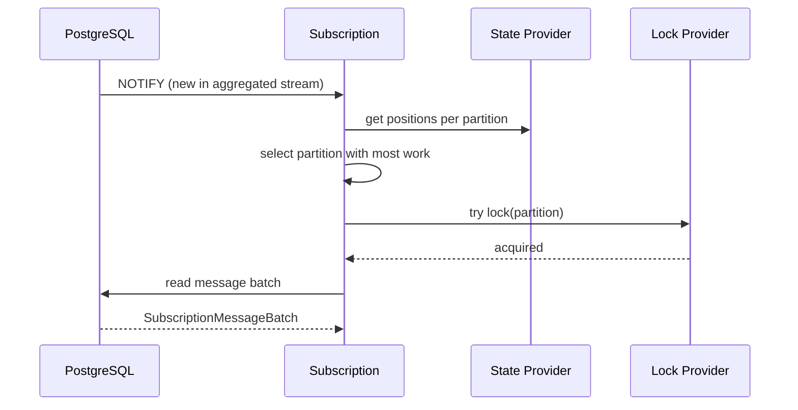
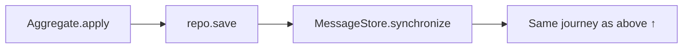
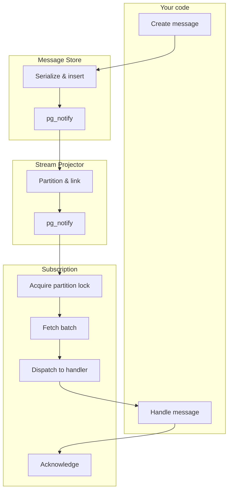

# The journey of a message

This page follows a single message through all the stages of Depeche DB --
from creation in your application code to being handled by a subscription.




## 1. Defining & creating a message

A message is a plain Pydantic model that implements two methods:
`get_message_id` and `get_message_time`. These are required by
Depeche DB to identify and order messages.

```python
import uuid
import datetime as dt
import pydantic

class AccountCredited(pydantic.BaseModel):
    account_id: uuid.UUID
    amount: int
    event_id: uuid.UUID = pydantic.Field(default_factory=uuid.uuid4)
    occurred_at: dt.datetime = pydantic.Field(default_factory=dt.datetime.utcnow)

    def get_message_id(self) -> uuid.UUID:
        return self.event_id

    def get_message_time(self) -> dt.datetime:
        return self.occurred_at
```

The message content is completely transparent to Depeche DB. It only cares
about the ID and the timestamp.


## 2. Writing to the message store

When you call `message_store.write()`, the message is serialized to JSON
and inserted into a PostgreSQL table.

```python
position = message_store.write(
    stream="account-123",
    message=AccountCredited(account_id=account_id, amount=100),
)
# position.stream == "account-123"
# position.version == 1          (sequential within the stream)
# position.global_position == 42 (sequential across all streams)
```

### What happens inside

1. The `PydanticMessageSerializer` converts the message to a JSON dict
   and adds a `__typename__` field so it can be deserialized later.
2. A PL/pgSQL function executes the actual insert. It acquires
   a **stream-level advisory lock** (based on a hash of the stream name)
   to prevent concurrent writes to the same stream.
3. If you passed an `expected_version`, it is compared to the current
   maximum version in the stream. A mismatch raises an
   `OptimisticConcurrencyError` -- this is how optimistic concurrency
   control works.
4. The message is assigned the next sequential `version` within the
   stream and the next `global_position` from a database sequence.
5. A PostgreSQL trigger fires `pg_notify()` to broadcast the new
   message on a notification channel.
6. The transaction commits.




## 3. Notification

The PostgreSQL trigger sends a `NOTIFY` on a channel specific to the message
store (e.g. `depeche_example_store_messages`). The payload includes the
`message_id`, `stream`, `version`, and `global_position`.

This notification is what makes Depeche DB **poll-free**. The executor
(see below) listens for these notifications and wakes up the relevant
components immediately.


## 4. Stream projection

The aggregated stream's **projector** picks up the notification and projects
the message into the aggregated stream.

### What happens inside

1. The projector acquires an exclusive lock on the aggregated stream table
   (to prevent concurrent projections).
2. It finds all origin streams that have unprocessed messages -- by comparing
   the last known `global_position` with the current state of the message
   store.
3. For each new message, it deserializes the content and calls your
   `MessagePartitioner` to determine which partition the message belongs to.
4. It inserts a row into the aggregated stream table. This row is a
   **reference** to the original message (not a copy).
5. It fires another `pg_notify()` on the aggregated stream's channel.



### Partitioning

Your partitioner decides which partition a message goes to. Messages within
the same partition are processed **in order** and **by a single consumer at a
time**. Messages in different partitions can be processed **in parallel**.

```python
class AccountIdPartitioner:
    def get_partition(self, message: StoredMessage[AccountEvent]) -> int:
        return hash(message.message.account_id) % 10
```

Choose your partition key carefully: messages that must be processed in order
need to end up in the same partition.


## 5. Subscription

The subscription is notified (again via `pg_notify`) that there are new
messages in the aggregated stream.

### What happens inside

1. The subscription reads its **state** -- the last processed position for
   each partition.
2. It selects partitions that have unprocessed messages, preferring
   partitions with the most work to do.
3. It tries to acquire a **partition lock** (a non-blocking advisory lock).
   If another instance already holds the lock, it moves on to the next
   partition. This is the **competing consumers** pattern.
4. It reads a batch of message references from the aggregated stream and
   fetches the actual message content from the message store.
5. It returns a `SubscriptionMessageBatch`.




## 6. Handling

The subscription runner iterates over the batch and dispatches each message
to your handler.

```python
class MyHandlers(MessageHandler[AccountEvent]):
    @MessageHandler.register
    def handle_credited(self, message: AccountCredited):
        print(f"Account credited: {message.amount}")
```

You can choose what your handler receives:

- The **plain message** (`AccountCredited`) -- just the domain object.
- A **`StoredMessage[AccountCredited]`** -- includes metadata like `stream`,
  `version`, `global_position`, and `added_at`.
- A **`SubscriptionMessage[AccountCredited]`** -- includes the partition,
  position within the partition, and an ack handle.


## 7. Acknowledgement

After your handler returns successfully, the message is acknowledged. This
means the subscription's position for that partition is advanced, so the
message will not be delivered again.

Two strategies are available:

| Strategy | Behavior | Trade-off |
|----------|----------|-----------|
| `SINGLE` | Position is stored after **each** message | Safer, but more DB writes |
| `BATCHED` | Position is stored after the **entire batch** | Faster, but replays the batch on crash |

Both strategies provide **at least once** delivery. If your handler fails or
the process crashes before acknowledgement, the message will be delivered
again on the next run.

You can achieve **exactly once** semantics by storing the subscription state
in the same database transaction as your application state (see
[Exactly once Delivery](../getting-started/ack_in_client_transaction.md)).


## 8. The executor ties it all together

In production, you don't call `projector.run()` and `subscription.runner.run()`
manually. Instead, the **executor** runs them for you. It listens for
PostgreSQL notifications and dispatches work to handler threads.

```python
executor = Executor(db_dsn=DB_DSN)
executor.register(aggregated_stream.projector)
executor.register(subscription.runner)
executor.run()
```

The executor also runs a **stimulator** thread that periodically nudges the
handlers, ensuring that messages are processed even if a notification was
missed.


## The event sourcing path

When using event sourcing, messages take a slightly different route into the
message store. Instead of calling `message_store.write()` directly, you work
with an aggregate root and a repository.

```python
# Load aggregate & apply a new event
account = repo.get(account_id)
account.apply(AccountCredited(account_id=account_id, amount=100))

# Save: synchronize events to the message store
repo.save(account, expected_version=account.version)
```

Under the hood:

1. `account.apply()` updates the aggregate's internal state and collects
   the event.
2. `repo.save()` calls `message_store.synchronize()` which compares the
   aggregate's events against what is already stored, and only writes the
   new ones.
3. The stream name is derived from the aggregate: e.g. `account-{id}`.
4. From here on, the message follows the same journey described above --
   notification, projection, subscription, handling.




## Summary


